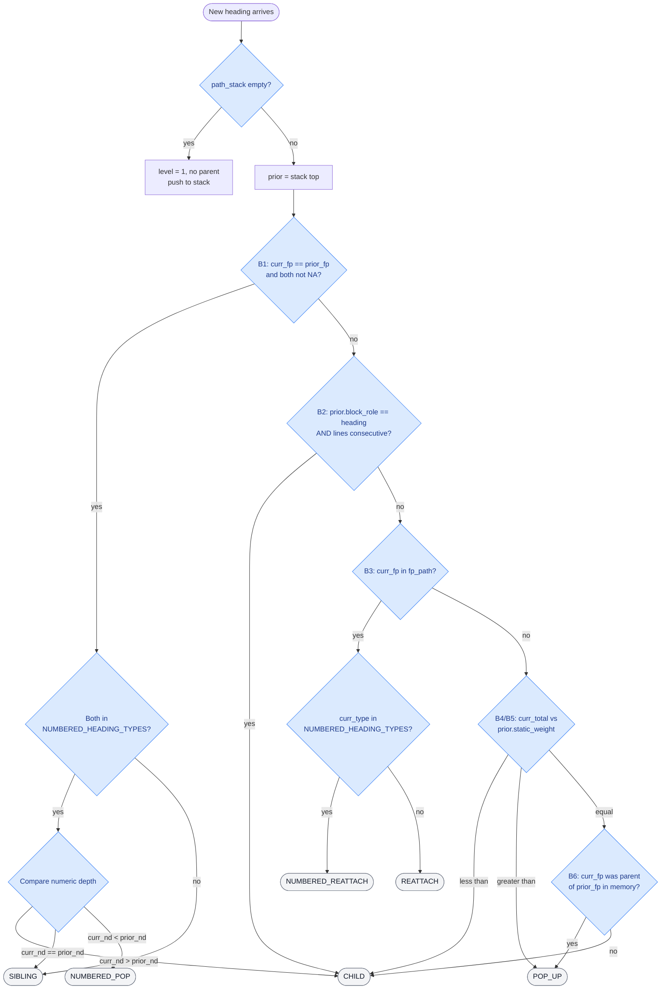
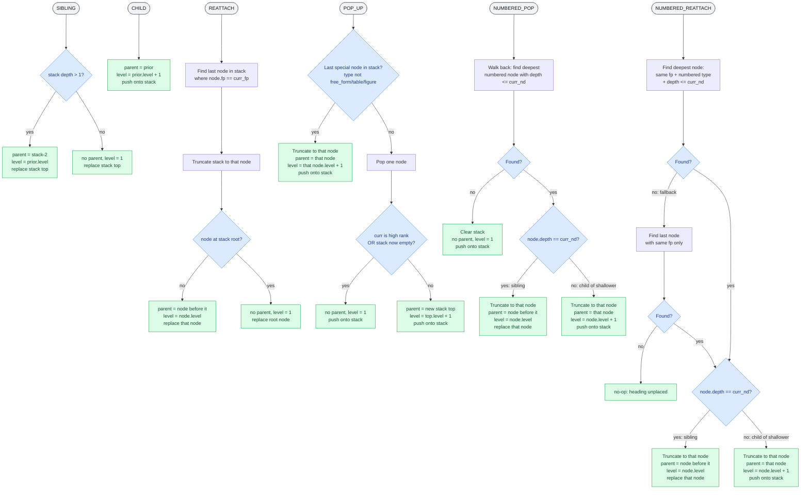

# Heading Hierarchy Decision Flow

Decision logic in `infer_heading_hierarchy` (`step_06_hierarchy_builder.py`).

Runs once per unique heading, in reading order. The **path_stack** holds the current ancestry chain from root to the most recently placed heading.

> **Preview:** [mermaid.live](https://mermaid.live) — paste either diagram block there. VS Code: install the "Markdown Preview Mermaid Support" extension.

---

## Part 1 — Decision tree



---

## Part 2 — Outcome handlers



---

## Decision priority summary

| # | Condition | Decision |
|---|-----------|----------|
| 1 | `curr_fp == prior_fp` — same fingerprint as stack top | **sibling** — or depth-routed for numbered sections |
| 2 | Prior is a real `heading` block and line IDs are consecutive | **child** |
| 3 | `curr_fp` appears anywhere earlier in the stack | **reattach** / **numbered_reattach** |
| 4 | `curr_total < prior.static_weight` | **child** |
| 5 | `curr_total > prior.static_weight` | **pop_up** |
| 6 | Equal weight | **pop_up** if curr was a known parent of prior, else **child** |

## Numbered section depth routing

Depth is extracted from the numeric prefix of the heading text:

| Text | Depth |
|------|-------|
| `1.` | 1 |
| `1.2.` | 2 |
| `1.2.3` | 3 |

Cross-article re-entry via **numbered_reattach** (branch 3):

```
ARTICLE VII        ← level 1
  Conditions       ← level 2
    7.1.           ← depth 1, level 3  ┐
    7.2.           ←                   ├ branch 1 sibling chain
    7.3.           ←                   ┘
ARTICLE VIII       ← branch 3 reattach    → level 1
  Termination      ← branch 4/5 weight   → level 2
    8.1.           ← branch 3 numbered_reattach, depth 1 → level 3
    8.2.           ← branch 1 sibling
```
